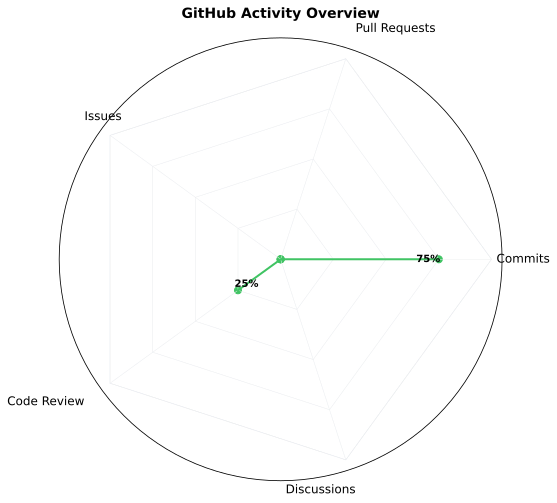

## Hi there, I am xiaomo 👋

> ### I am a Node.js full-stack engineer with a background in embedded systems, and I have participated in electronic design and mathematical modeling competitions.  
In my professional work, I have been involved in the development of web-based CAD systems and automotive HMI (Human–Machine Interface) applications.

> ### 我是一名node.js 全栈工程师（有电子设计竞赛、数学建模竞赛经历的嵌入式专业）。工作中参与过 WebCAD、HMI（Automotive） 相关开发工作。

### 🛠️ Tech Stack:

  
  
  
  
  
  
  
  
  
  
  

### 📫 Contact Me:

- **E-mail** : XL18791036@163.com

### 🏠 Blob:

- **[My juejin](https://juejin.cn/user/132388463586589/posts)**
- **[My YuQue](https://www.yuque.com/u33888)**

### 🛠️ Project:

- **[Web3 Geek Garden](https://app.trainxm.xyz)**

<!-- 

  
  
  <h3>GitHub Metrics</h3>
  

 -->
